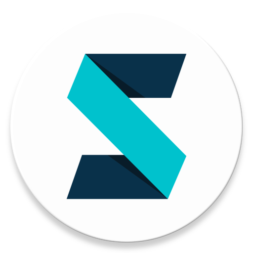

什么是 SchoolPower-UWP
-------
SchoolPower-UWP 是使用 C# 编写的开源、现代化的 [PowerSchool](https://www.powerschool.com/) 客户端替代品。后端在 [SchoolPower/SchoolPower-Backend](https://github.com/SchoolPower/SchoolPower-Backend).
